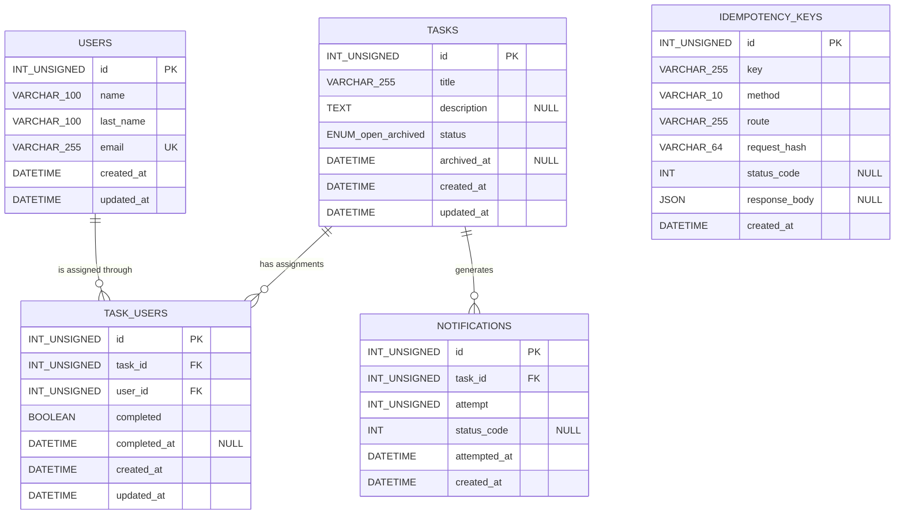

# Database UML



## Relationships

- `USERS 1:N TASK_USERS`
- `TASKS 1:N TASK_USERS`
- Therefore, `USERS N:M TASKS` through `TASK_USERS`.
- `TASKS 1:N NOTIFICATIONS`.
- `IDEMPOTENCY_KEYS` is an independent operational table used to guarantee idempotent POST requests.

## Constraints

### users

```text
PRIMARY KEY (id)
UNIQUE (email)
```

### task_users

```text
PRIMARY KEY (id)
FOREIGN KEY (task_id) REFERENCES tasks(id)
FOREIGN KEY (user_id) REFERENCES users(id)

UNIQUE (task_id, user_id)

ON UPDATE CASCADE
ON DELETE CASCADE
```

### notifications

```text
PRIMARY KEY (id)
FOREIGN KEY (task_id) REFERENCES tasks(id)

UNIQUE (task_id, attempt)

ON UPDATE CASCADE
ON DELETE CASCADE
```

### idempotency_keys

```text
PRIMARY KEY (id)

UNIQUE (key, method, route)
```

`status_code` and `response_body` are nullable because `NULL` represents an idempotent operation that has been reserved but has not finished processing yet.

## Business Rules Represented by the Model

`TASK_USERS` stores the completion state of every user assigned to a task:

```text
completed = false
completed_at = NULL
```

When the user completes their participation:

```text
completed = true
completed_at = timestamp
```

When all assignments for a task are completed:

```text
tasks.status = archived
tasks.archived_at = timestamp
```

Archiving triggers the notification mechanism.

Every notification attempt is recorded in `NOTIFICATIONS`:

```text
task_id
attempt
status_code
attempted_at
```

If the external destination does not return an HTTP response:

```text
status_code = NULL
```

`IDEMPOTENCY_KEYS` stores the request identity and final response so duplicated POST requests can safely return the original result instead of executing the operation twice.